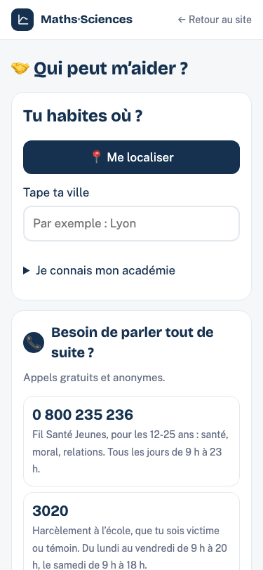

# Extension nationale de « Qui peut m’aider ? »

Revue du 7 octobre 2026. Branche `aide-france`, issue de `origin/main` `6ad173c`.
PR à relire, sans fusion ni publication.

## Résultat

Les 30 académies disposent d’un fichier et d’un lien direct `/aide/<slug>/`.
L’application reste unique (`aide/index.html`). Les petites pages chargent cette
application, puis l’adaptateur national. `/aide/france/` sert d’entrée nationale ;
les pages et QR codes historiques restent sur l’Île-de-France, sans question.
Le hash de situation est conservé après le choix d’une académie.

`commun/academies.json` contient la liste unique (slug stable, nom complet,
départements, région). `commun/academie.js` assure le choix, la priorité du chemin,
la recherche BAN, le calcul local de position, la ligne « changer » et le rappel
`onSelect(academie, {signal})`. La clé est `stages.academie`, protégée par try/catch.
Les autres outils pourront réutiliser ce module sans le recopier. Les pages IDF
ne le chargent pas. `commun/departements.json` et `commun/contours/` servent au
calcul local : aucune position n’est envoyée, aucun géocodage distant au clic GPS.

Le périmètre est limité à `aide/`, `commun/`, `source/aide.py`,
`source/verif_idf.py`, `source/README.md` et les deux paragraphes sources/vie privée
de `faq/index.html`. Aucun changement à `data/`, à la racine `index.html`,
aux pages de formation, à La bonne alternance ou à sa tâche mensuelle.

## Sources et dates

Toutes les sources ont été consultées/téléchargées le **7 octobre 2026** :

- [Annuaire Service-public.fr / DILA](https://api-lannuaire.service-public.fr/api/explore/v2.1/catalog/datasets/api-lannuaire-administration/exports/json) : types `cio`, `mission_locale`, `cij`. La requête sélectionne les champs de structure, jamais `affectation_personne` ni les courriels. Les dates individuelles de modification sont conservées. Le type `mda` n’est pas utilisé.
- [Ministère de la Culture — export national du 27 août 2025](https://static.data.gouv.fr/resources/adresses-des-bibliotheques-publiques-2/20250827-130724/adresses-des-bibliotheques-publiques.json) : enquête **2023**. Municipales, intercommunales et SIVOM, bâtiment ouvert, hors bibliobus et ouvertures connues inférieures à 4 h/semaine. Casse normalisée comme auparavant.
- [Annuaire ANMDA](https://anmda.fr/fr/annuaire-mda) : **327 fiches distinctes**, pagination comprise, collectées avec un User-Agent navigateur et 2,5 s entre les téléchargements. Adresses, téléphones, horaires et coordonnées des fiches, sans descriptions libres ni courriels. Le premier numéro valide est conservé quand un champ contient deux téléphones.
- [Annuaire national de l’Éducation nationale](https://data.education.gouv.fr/explore/dataset/fr-en-annuaire-education/) : collèges `OUVERT`, dédoublonnage par UAI, coordonnées nécessaires pour servir de départ. Les requêtes exactes sont dans `aide/data/bilan.json`.
- [Ministère — 30 académies](https://www.education.gouv.fr/les-regions-academiques-academies-et-services-departementaux-de-l-education-nationale-6557) et [Code de l’éducation, article R222-2](https://www.legifrance.gouv.fr/codes/section_lc/LEGITEXT000006071191/LEGISCTA000006151410/) : correspondance des 101 départements, sans doublon. Normandie et Mayotte prises en compte.
- [Contours Etalab/IGN 2025 à 100 m, Licence Ouverte](https://etalab-datasets.geo.data.gouv.fr/contours-administratifs/2025/geojson/departements-100m.geojson) : découpage en fichiers départementaux, sélection locale par emprise puis test dans le polygone. [API Découpage administratif](https://geo.api.gouv.fr/decoupage-administratif/communes) utilisée seulement pendant la génération pour vérifier les codes postaux corses, sans déduire le département d’une latitude.

## Effectifs et poids des données

**15 804 lieux** et **9 001 collèges** dans les 30 fichiers. CIO : 429 ; missions locales : 1067 ; Info Jeunes : 1048 ; bibliothèques : 12943 ; maisons des adolescents : 317.

| Académie | CIO | Missions locales | Info Jeunes | Bibliothèques | MDA | Collèges | JSON (octets) | Gzip indicatif (Ko) |
|---|---:|---:|---:|---:|---:|---:|---:|---:|
| Aix-Marseille | 19 | 46 | 57 | 337 | 29 | 351 | 204443 | 39.6 |
| Amiens | 16 | 31 | 28 | 407 | 4 | 285 | 170809 | 34.1 |
| Besançon | 8 | 22 | 17 | 294 | 20 | 173 | 124356 | 24.0 |
| Bordeaux | 26 | 59 | 70 | 778 | 13 | 473 | 333723 | 65.7 |
| Clermont-Ferrand | 12 | 22 | 15 | 626 | 9 | 213 | 212106 | 37.1 |
| Corse | 6 | 11 | 8 | 55 | 3 | 45 | 30654 | 6.4 |
| Créteil | 36 | 72 | 62 | 339 | 6 | 562 | 239114 | 45.5 |
| Dijon | 13 | 30 | 21 | 537 | 10 | 238 | 199701 | 38.1 |
| Grenoble | 15 | 59 | 51 | 896 | 11 | 414 | 348355 | 67.8 |
| Guadeloupe | 5 | 6 | 1 | 24 | 2 | 71 | 21054 | 4.6 |
| Guyane | 3 | 2 | 1 | 16 | 2 | 59 | 13869 | 3.2 |
| La Réunion | 7 | 16 | 17 | 67 | 3 | 122 | 52205 | 9.8 |
| Lille | 19 | 98 | 62 | 630 | 7 | 586 | 313080 | 60.5 |
| Limoges | 9 | 15 | 20 | 281 | 4 | 111 | 107395 | 20.8 |
| Lyon | 18 | 40 | 48 | 624 | 7 | 403 | 257544 | 50.5 |
| Martinique | 4 | 19 | 0 | 26 | 1 | 77 | 28341 | 5.9 |
| Mayotte | 0 | 2 | 10 | 12 | 1 | 36 | 11413 | 2.6 |
| Montpellier | 17 | 35 | 59 | 829 | 10 | 360 | 312275 | 59.0 |
| Nancy-Metz | 19 | 41 | 36 | 368 | 14 | 319 | 180842 | 34.9 |
| Nantes | 14 | 84 | 59 | 865 | 50 | 524 | 387902 | 73.7 |
| Nice | 11 | 35 | 40 | 230 | 2 | 237 | 126933 | 25.5 |
| Normandie | 24 | 73 | 45 | 626 | 40 | 475 | 300124 | 59.1 |
| Orléans-Tours | 21 | 35 | 42 | 697 | 12 | 368 | 278807 | 52.6 |
| Paris | 9 | 8 | 25 | 66 | 2 | 229 | 57643 | 11.5 |
| Poitiers | 14 | 42 | 25 | 547 | 8 | 258 | 216191 | 40.6 |
| Reims | 9 | 23 | 26 | 286 | 5 | 197 | 122444 | 24.4 |
| Rennes | 17 | 33 | 54 | 942 | 7 | 463 | 354779 | 68.1 |
| Strasbourg | 11 | 24 | 14 | 261 | 4 | 241 | 118914 | 22.1 |
| Toulouse | 22 | 33 | 57 | 780 | 20 | 415 | 303528 | 58.9 |
| Versailles | 25 | 51 | 78 | 497 | 11 | 696 | 291728 | 56.0 |

Gzip mesuré localement, sans présumer de la compression de l’hébergeur. Un seul fichier d’académie est chargé, de 11.4 à 387.9 Ko bruts.

- `commun/academie.js` : 8694 octets.
- `commun/academies.json` : 4838 octets.
- `commun/departements.json` : 5366 octets.
- Contours départementaux : 1716 à 66212 octets chacun, uniquement au clic GPS et pour les emprises concernées.
- GPS simulé à Lyon : contours 01, 38, 69, 55534 octets bruts, hors petit index.
- GPS simulé à Lille : contours 59, 62, 53531 octets bruts, hors petit index.
- GPS simulé à Marseille : contours 13, 21451 octets bruts, hors petit index.
- GPS simulé à Rennes : contours 35, 26342 octets bruts, hors petit index.
- GPS simulé à Saint-Denis de La Réunion : contours 974, 8000 octets bruts, hors petit index.

## Maisons des adolescents écartées

317 fiches retenues sur 327. Les fiches suivantes restent dans le relevé source
pour permettre leur suivi, mais sont absentes des listes d’accueil affichées :

- [La Maison des Adolescents de la Creuse](https://anmda.fr/fr/la-maison-des-adolescents-de-la-creuse) : Adresse ou coordonnées absentes.
- [L'AGORA MDA NORD, antenne de Thouars](https://anmda.fr/fr/lagora-mda-nord-antenne-de-thouars) : Adresse ou coordonnées absentes.
- [L'AGORA MDA SUD, antenne de Melle](https://anmda.fr/fr/lagora-mda-sud-antenne-de-melle) : Adresse ou coordonnées absentes.
- [Maison des Adolescents de la Manche - Annexe de Picauville](https://anmda.fr/fr/maison-des-adolescents-de-la-manche-annexe-de-picauville) : Adresse ou coordonnées absentes.
- [Maison des Adolescents de l'Aisne](https://anmda.fr/fr/maison-des-adolescents-de-laisne) : Adresse ou coordonnées absentes.
- [Maison des Adolescents de Polynesie Francaise - FARE TAMA HAU](https://anmda.fr/fr/maison-des-adolescents-de-polynesie-francaise-fare-tama-hau) : Hors des 30 académies ou département absent.
- [Maison des Adolescents de Vendée - Permanence de Noirmoutier](https://anmda.fr/fr/maison-des-adolescents-de-vendee-permanence-de-noirmoutier) : Adresse ou coordonnées absentes.
- [Maison des Adolescents de Vendée - Permanence Les Essarts](https://anmda.fr/fr/maison-des-adolescents-de-vendee-permanence-les-essarts) : Adresse ou coordonnées absentes.
- [Maison des Adolescents des Hautes-Alpes - antenne mobile Buech Durance](https://anmda.fr/fr/maison-des-adolescents-des-hautes-alpes-antenne-mobile-buech-durance) : Adresse ou coordonnées absentes.
- [Maison Des Adolescents des Hauts-de-Seine - Issy les Moulineaux](https://anmda.fr/fr/maison-des-adolescents-des-hauts-de-seine-issy-les-moulineaux) : La fiche réserve ce lieu uniquement à l’atelier « Un temps à soi », le vendredi ; ce n’est pas un accueil général..

Les trois fiches KAZ’ADO de La Réunion mentionnent des ateliers **et** des entretiens
individuels/familiaux : elles restent incluses. La fiche de Picauville a en plus
un point géographique incohérent ; aucune adresse n’a été devinée.
Les autres exclusions sont tracées dans `aide/data/bilan.json` : un lieu Info Jeunes
sans coordonnées, la mission locale de Saint-Martin (territoire à confirmer), et
trois bibliothèques dont le champ adresse contient uniquement un courriel ou une
adresse incomplète après son retrait. Les courriels présents par erreur dans les
champs adresse ont été retirés des nouvelles données, sans toucher au fichier IDF.

## Cinq lieux vérifiés

Tirage avec graine `20261007` (échantillon conservé dans `echantillon.json`), un type par académie parmi les
lieux disposant d’un téléphone. Adresse et téléphone comparés à la fiche source,
indépendamment du contrôle de structure des JSON :

| Lieu | Adresse dans les données | Téléphone | Source vérifiée |
|---|---|---|---|
| CIO de Montbrison — Lyon | Parc des Comtes-du-Forez, 42600 Montbrison | 04 77 58 53 77 | [Service-public.fr](https://lannuaire.service-public.gouv.fr/auvergne-rhone-alpes/loire/5b3bb67a-e2a6-4107-aebe-b70056019375) |
| Mission locale de Hem — Lille | Maison de l’Emploi / Val de Marque, 4 parvis Berthelot, 59510 Hem | 03 20 66 70 15 | [Service-public.fr](https://lannuaire.service-public.gouv.fr/hauts-de-france/nord/4a0d18ba-9c3e-4540-a0cb-e7fe19293527) |
| Point information jeunesse d’Aubagne — Aix-Marseille | La Boussole, 80 avenue des Sœurs-Gastine, 13400 Aubagne | 04 42 01 56 56 | [Service-public.fr](https://lannuaire.service-public.gouv.fr/provence-alpes-cote-d-azur/bouches-du-rhone/1c264835-f078-4077-84e3-8d18c5294149) |
| Bibliothèque municipale Jacques Prévert de Lanrivoaré — Rennes | Rue de la Mairie, 29290 Lanrivoaré | 02 98 84 37 73 | Export Culture, entrée `LI1118` ; [mairie](https://lanrivoare.fr/culture-et-loisirs/bibliotheque/) (précise le n° 1, absent de l’export ; aucun numéro ajouté) |
| KAZ’ADO Ouest — La Réunion | 31 bis rue Labourdonnais, 97460 Saint Paul | 02 62 74 22 40 | [Fiche ANMDA](https://anmda.fr/fr/maison-des-adolescents-de-la-reunion-kazado-ouest), HTML téléchargé consulté |

## Vérifications

- Python : compilation, contrôle des 30 académies / 101 départements, formats des téléphones, coordonnées, champs autorisés, absence de courriels dans les nouvelles données et conservation du JSON IDF.
- Navigateur Chromium à **375 × 812 px** : Lyon, Lille, Aix-Marseille, Rennes, La Réunion par lien direct, GPS simulé et ville BAN réelle, puis « changer ». Collège, mémoire remplacée par le lien, hash conservé, absence de débordement horizontal et contrôles réseau.
- Refus GPS et localStorage indisponible : repli ville, choix manuel et rechargement du lien fonctionnels. Aucune position stockée ou envoyée ; BAN seulement à la saisie.
- Aucune erreur de console sur les parcours testés. Pas de requête vers `commun/` sur `/aide/` même quand une autre académie est mémorisée.
- `git diff --check` et vérification du périmètre.

Résultat intégral de `source/verif_idf.py` (sources historiques retrouvées dans un
cache temporaire de la machine, exécution du script en mode par défaut dans un
dossier temporaire indépendant) :

```text
Référence origin/main : 6ad173cdd030422e6995848b56ab2eac753a89b2
aide/aide.json : identique à origin/main ; SHA-256 0e7273d055ab81dc8d2ab14fa4dca3fae6ef12283928ae2479aff6ee566625a7
apres-3e/apres3e.json : identique à origin/main ; SHA-256 eb16cf4f0e77fa2fe076b71ee20fbec77636dcb075a289e894fc6b28c6374d8b
formation/formations.json : identique à origin/main ; SHA-256 f7a477eff3766dfc24df573358658e067112c6b3f79f05bb9851cd3cee234270
Régénération aide (mode par défaut) : identique à l’octet près
Après le collège / Après le lycée : fichiers comparés ; régénération à ajouter lors de leurs missions nationales.
/aide/ : identique, sans erreur
/aide/#mda : identique, sans erreur
/apres-3e/ : identique, sans erreur
/apres-3e/#cuisine : identique, sans erreur
/formation/ : identique, sans erreur
/formation/#eeb : identique, sans erreur
/formation/#iccer : identique, sans erreur
/ : identique, sans erreur
/henaff/ : identique, sans erreur
/iccer : identique, sans erreur
Île-de-France identique : oui
Rapport et captures : /private/tmp/aide-france-cache/verif-idf-final
```

Les PNG des dix pages locales et en ligne sont également identiques octet par octet : **10/10**.

Le déploiement canonique GitHub Pages est utilisé pour ces dix comparaisons.
Le domaine personnalisé `/stages/` ouvre actuellement `accueil/`, et non `index.html`
de la racine. Le fichier en ligne `/stages/aide/aide.json` a aussi été téléchargé :
son SHA-256 est celui de l’original et de la copie de travail.

## Captures téléphone

### Question nationale



### Académie de Lyon


### Île-de-France historique


## Limites et suites

- La couverture porte sur les **30 académies et les 101 départements**. La Polynésie, la Nouvelle-Calédonie, Wallis-et-Futuna et Saint-Pierre-et-Miquelon ont des organisations spécifiques. Saint-Martin et Saint-Barthélemy ne sont pas assimilés au département 971 à partir d’un code postal : rattachements à confirmer avant leur intégration. Les collèges hors périmètre sont comptés dans `bilan.json`.
- L’annuaire ANMDA n’est pas une garantie d’exhaustivité ou d’actualité ; les huit fiches sans adresse/coordonnées exploitables nécessitent une correction par la source ou une vérification complémentaire. Aucun point n’a été inventé.
- Les contours sont simplifiés à 100 m. Sur une frontière ou hors contour, le parcours demande la ville. Les emprises ne servent qu’à sélectionner les fichiers, jamais à attribuer l’académie.
- Un zéro dans le tableau signifie absence de lieu retenu dans la source, pas preuve d’absence de service (notamment CIO à Mayotte et Info Jeunes en Martinique).
- Certaines sources n’indiquent pas de téléphone, d’horaires ou de numéro de rue ; pas de complément inventé. Données des bibliothèques issues de l’enquête 2023, donc à vérifier avant déplacement.
- Les trois autres outils restent à étendre dans leurs PR propres. La régénération de leurs données s’ajoutera à `verif_idf.py` lors de ces missions ; leurs fichiers et pages sont déjà comparés ici.
- Aucun déploiement, aucune fusion. Attendre l’avis de Naïm sur cette PR.
