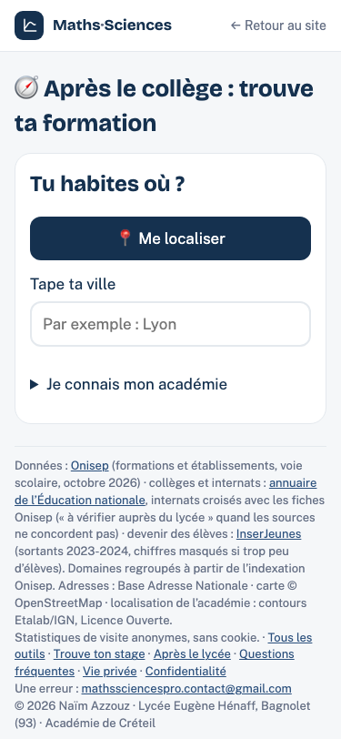
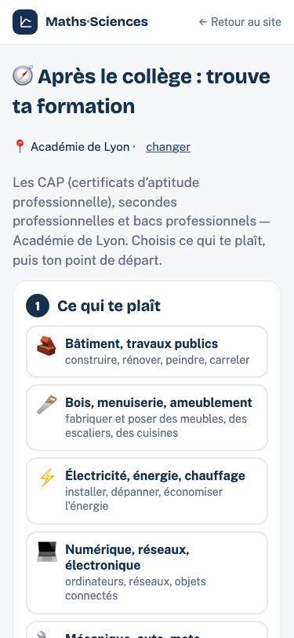
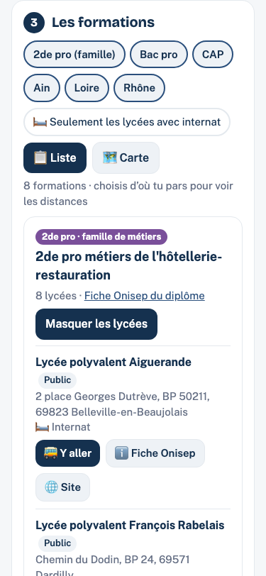
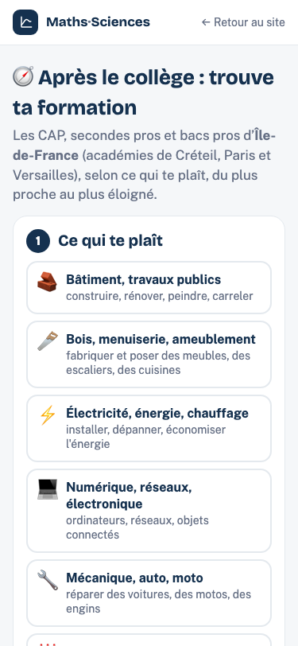

# Après le collège — 30 académies

Préparé le 7 octobre 2026 sur `apres3e-france`, depuis `origin/main` `446ada2`.
Travail dans la copie isolée `carte-stages-a3-france`. PR à relire, sans fusion ni publication.

## Comportement et périmètre

`/apres-3e/france/` ouvre le sélecteur partagé, ou l’académie déjà retenue.
Les 30 liens `/apres-3e/<slug>/` prennent priorité sur ce choix et conservent
le domaine du hash. Chaque page ne charge que son fichier d’académie.
Le filtre des lycées porte sur les départements lorsque l’académie en a plusieurs.
Le rappel Affelnet renvoie vers l’académie de l’élève et son collège pour une demande ailleurs.

`commun/academie.js`, `academies.json`, `departements.json` et les contours
sont **réutilisés sans aucun changement**. Aucune seconde version du sélecteur.
Les nouveaux fichiers sont dans `apres-3e/`, avec `source/apres3e_national.py`
comme aide au générateur et l’ajout de la régénération dans `source/verif_idf.py`.
La FAQ et `source/README.md` restent inchangés ; leurs textes proposés sont dans la PR.

La page historique n’a que deux adaptations sans effet sur son rendu :
le chargement IDF est ignoré dans le parcours national et la modification du hash
conserve explicitement le chemin courant. `/apres-3e/` garde ses trois académies,
sans sélecteur supplémentaire. Les autres outils et les adresses Hénaff sont inchangés.

## Sources et dates

- [Onisep — Idéo, actions de formation initiale, univers lycée](https://opendata.onisep.fr/data/605340ddc19a9/2-ideo-actions-de-formation-initiale-univers-lycee.htm) : fichier `605340ddc19a9.csv` du **6 octobre 2026**, exactement celui du générateur historique. Filtre explicite `ENS académie`, mêmes types de diplômes, mêmes domaines et corrections existantes. Voie scolaire, y compris alternance sous statut scolaire. Les téléphones et les champs de contacts ne sont pas exportés.
- [Annuaire de l’Éducation nationale](https://data.education.gouv.fr/explore/dataset/fr-en-annuaire-education/) : export du **7 octobre 2026**, **68 565 lignes**, uniquement champs de structure nécessaires. Collèges ouverts, coordonnées valides, dédoublonnage par UAI. Pour les internats, rapprochement exact par UAI avec tous les types de structures de l’annuaire (certains établissements Onisep ne sont pas étiquetés « Lycée »).
- [InserJeunes — voie professionnelle scolaire par établissement et formation fine](https://data.education.gouv.fr/explore/dataset/fr-en-inserjeunes-lycee_pro-formation-fine/) : export national du **7 octobre 2026**, **22 458 lignes**, période **cumul 2023-2024**, comme la page historique. Même UAI, diplôme et option ; seuil historique de ressemblance 0,95. Un intitulé exact est prioritaire ; si plusieurs formations/statistiques restent possibles, aucun chiffre. **6 520 offres** disposent d’au moins un indicateur, sans moyenne ni imputation.
- [Draio Créteil — bilan de l’affectation 2025](https://orientation.ac-creteil.fr/bilans-de-laffectation-de-lorientation/) : `pression_2025.json` existant du 7 octobre 2026, correspondance existante inchangée. **569 offres à Créteil** ont des premiers vœux et places ; **zéro ailleurs**. © www.ac-creteil.fr - académie de Créteil.
- [Ministère — orientation en 3e et affectation en lycée](https://www.education.gouv.fr/reussir-au-lycee/l-orientation-en-3e-et-l-affectation-en-lycee-9257) : consulté le 7 octobre 2026 pour le rappel Affelnet.
- Choix d’académie : catalogue officiel, BAN et contours Etalab/IGN déjà documentés par le module commun. Aucun nouveau service tiers au chargement. BAN est appelé à la saisie ; le GPS utilise les contours locaux, sans envoyer de position.

Les requêtes exactes, dates de fichiers et SHA-256 sont dans
[`data/bilan.json`](../data/bilan.json). Les caches bruts restent hors du dépôt.

## Effectifs et tailles

**21 060 offres formation–établissement**, **3 215 lycées/structures Onisep** et
**9 001 collèges de départ**. Une formation peut être proposée par plusieurs lycées.
Les lycées sont comptés par fiche Onisep distincte ; une offre est dédoublonnée
par formation et UAI (ou nom en l’absence d’UAI), comme dans la génération historique.

Internats : **2 020 sur place concordants**, **201 hébergements dans un autre
établissement**, **123 à vérifier**. Les restrictions indiquées par Onisep sont conservées.
La présence d’un internat ne garantit pas une place disponible.

Les 30 JSON totalisent **10 295 877 octets**, mais un seul est chargé par choix :
**57 599 à 654 151 octets** (gzip indicatif : environ **6 à 85 Ko**).
Les poids gzip ci-dessous sont des mesures locales, pas une garantie de configuration du serveur.

| Académie / fichier JSON | Formations | Offres | Lycées | Collèges | Internats sur place | Ailleurs | À vérifier | Octets | Gzip octets |
|---|---:|---:|---:|---:|---:|---:|---:|---:|---:|
| Aix-Marseille (`aix-marseille.json`) | 159 | 1014 | 140 | 351 | 62 | 4 | 4 | 476831 | 54767 |
| Amiens (`amiens.json`) | 142 | 723 | 107 | 285 | 83 | 11 | 3 | 369156 | 41301 |
| Besançon (`besancon.json`) | 121 | 415 | 78 | 173 | 59 | 2 | 7 | 219043 | 25285 |
| Bordeaux (`bordeaux.json`) | 166 | 1111 | 177 | 473 | 140 | 12 | 6 | 520525 | 62319 |
| Clermont-Ferrand (`clermont-ferrand.json`) | 141 | 485 | 84 | 213 | 69 | 4 | 2 | 253920 | 28401 |
| Corse (`corse.json`) | 58 | 99 | 12 | 45 | 10 | 0 | 1 | 57599 | 6032 |
| Créteil (`creteil.json`) | 149 | 1012 | 152 | 562 | 25 | 4 | 6 | 488115 | 61554 |
| Dijon (`dijon.json`) | 140 | 613 | 97 | 238 | 80 | 7 | 0 | 336266 | 39323 |
| Grenoble (`grenoble.json`) | 151 | 1172 | 191 | 414 | 143 | 10 | 4 | 565562 | 73844 |
| Guadeloupe (`guadeloupe.json`) | 100 | 227 | 26 | 71 | 9 | 0 | 3 | 115717 | 11175 |
| Guyane (`guyane.json`) | 107 | 230 | 24 | 59 | 10 | 1 | 6 | 116722 | 10437 |
| La Réunion (`la-reunion.json`) | 137 | 409 | 44 | 122 | 21 | 15 | 2 | 231669 | 18962 |
| Lille (`lille.json`) | 156 | 1399 | 196 | 586 | 87 | 30 | 17 | 654151 | 84851 |
| Limoges (`limoges.json`) | 116 | 247 | 43 | 111 | 38 | 0 | 1 | 131614 | 14198 |
| Lyon (`lyon.json`) | 164 | 1053 | 162 | 403 | 89 | 22 | 3 | 517595 | 61216 |
| Martinique (`martinique.json`) | 102 | 182 | 26 | 77 | 11 | 1 | 4 | 100923 | 10354 |
| Mayotte (`mayotte.json`) | 85 | 136 | 21 | 36 | 1 | 0 | 1 | 68473 | 6736 |
| Montpellier (`montpellier.json`) | 169 | 874 | 129 | 360 | 87 | 4 | 9 | 419208 | 47592 |
| Nancy-Metz (`nancy-metz.json`) | 136 | 695 | 118 | 319 | 81 | 18 | 1 | 373217 | 44210 |
| Nantes (`nantes.json`) | 171 | 1375 | 226 | 524 | 164 | 14 | 6 | 651934 | 82450 |
| Nice (`nice.json`) | 130 | 511 | 60 | 237 | 26 | 5 | 2 | 241725 | 23338 |
| Normandie (`normandie.json`) | 173 | 1107 | 176 | 475 | 140 | 6 | 5 | 536778 | 65617 |
| Orléans-Tours (`orleans-tours.json`) | 149 | 823 | 120 | 368 | 95 | 11 | 3 | 404341 | 46125 |
| Paris (`paris.json`) | 138 | 339 | 79 | 229 | 3 | 1 | 4 | 172993 | 20853 |
| Poitiers (`poitiers.json`) | 159 | 624 | 107 | 258 | 94 | 1 | 2 | 295486 | 33002 |
| Reims (`reims.json`) | 122 | 498 | 68 | 197 | 59 | 1 | 2 | 226851 | 22298 |
| Rennes (`rennes.json`) | 160 | 1101 | 175 | 463 | 141 | 6 | 10 | 536036 | 67987 |
| Strasbourg (`strasbourg.json`) | 119 | 502 | 60 | 241 | 29 | 8 | 2 | 244580 | 23934 |
| Toulouse (`toulouse.json`) | 164 | 961 | 155 | 415 | 126 | 2 | 4 | 444312 | 54567 |
| Versailles (`versailles.json`) | 144 | 1123 | 162 | 696 | 38 | 1 | 3 | 524535 | 66831 |

## Cinq vérifications Onisep

Tirage reproductible : `random.Random(20261007)`, une fiche lycée au hasard dans
chacune des cinq académies demandées, puis une formation au hasard dans ce lycée.
Fiches consultées le **7 octobre 2026** ; formation, adresse et hébergement comparés
au JSON. Les cinq vérifications concordent. Les codes postaux Cedex sont conservés.

| Académie | Fiche Onisep | Formation vérifiée | Adresse | Hébergement |
|---|---|---|---|---|
| Lyon | [Lycée polyvalent du Bugey](https://www.onisep.fr/ressources/structures-enseignement/auvergne-rhone-alpes/ain/lycee-polyvalent-du-bugey) | Bac pro métiers de l’électricité et de ses environnements connectés | 113 rue du 5e RTM, BP 157, 01306 Belley | Internat filles-garçons ; annuaire concordant |
| Lille | [Lycée professionnel André Malraux](https://www.onisep.fr/ressources/structures-enseignement/hauts-de-france/pas-de-calais/lycee-professionnel-andre-malraux) | Bac pro métiers de l’accueil | 700 rue de l’Université, BP 90817, 62408 Béthune | Internat filles-garçons ; annuaire concordant |
| Aix-Marseille | [Lycée polyvalent privé Célony](https://www.onisep.fr/ressources/structures-enseignement/provence-alpes-cote-d-azur/bouches-du-rhone/lycee-polyvalent-prive-celony) | Bac pro métiers de l’accueil | 4 bis avenue de Lattre de Tassigny, 13090 Aix-en-Provence | Sans hébergement ; aucun badge internat |
| Rennes | [Lycée polyvalent Chaptal](https://www.onisep.fr/ressources/structures-enseignement/bretagne/cotes-d-armor/lycee-polyvalent-chaptal) | Bac pro métiers de l’électricité et de ses environnements connectés | 6 allée Chaptal, 22000 Saint-Brieuc | Internat filles-garçons ; annuaire concordant |
| La Réunion | [Lycée professionnel Amiral Lacaze](https://www.onisep.fr/ressources/structures-enseignement/la-reunion/la-reunion/lycee-professionnel-amiral-lacaze) | CAP électricien | 1 avenue Stanislas Gimart, BP 192, 97493 Saint-Denis | Hébergement hors établissement, au lycée Georges Brassens ; indiqué « dans un autre lycée » |

Le bouton « Fiche Onisep » du parcours national ouvre bien la fiche Onisep du lycée :
le champ brut `AF page web` peut désigner un site d’établissement, comme pour Chaptal.

## Vérifications navigateur et données

Chromium/Playwright, serveur local, **375 × 812 px** :

- Lyon, Lille, Aix-Marseille, Rennes, La Réunion : lien direct prioritaire sur Paris mémorisé, GPS simulé aux coordonnées de la ville, vraie requête BAN (« Lyon », « Lille », « Marseille », « Rennes », « Saint-Denis 97400 »), retour « changer », puis choix dans la liste repliée.
- Collège de départ, résultats, filtre départemental, fiche lycée, hash conservé ; carte testée à Lyon. Les résultats se réinitialisent lors d’un changement d’académie.
- Les 30 liens directs avec `#cuisine` chargent les bonnes données. Pression présente seulement à Créteil, rappel Affelnet présent partout.
- Stockage interdit et GPS refusé : repli utilisable, choix manuel et rechargement du lien. Erreur de chargement simulée : message, résultats cachés, nouvelle tentative réussie.
- Un seul JSON d’académie avant interaction, aucun fichier IDF sur le parcours national, aucun contour avant le clic GPS, aucun appel BAN avant saisie. Carte OSM seulement après activation.
- Aucun débordement horizontal aux chargements contrôlés ; **aucune erreur de console** hors l’erreur HTTP volontaire du test de panne.
- Les 21 060 offres ont été comparées au CSV : formation, lycée, adresse, hébergement et domaines. Aucun courriel dans les données publiables. Les trois JSON historiques et `commun/` restent identiques à `origin/main`.

Commandes reproductibles depuis la racine (Python standard, curl, Node et Playwright) :

```sh
python3 source/apres3e.py --academies toutes --sources /chemin/sources --cache /chemin/cache-national
# Ou un sous-ensemble : --academies lyon lille aix-marseille rennes la-reunion
python3 apres-3e/tests/donnees.py --sources /chemin/sources
python3 -m http.server 8766 --bind 127.0.0.1
BASE_URL=http://127.0.0.1:8766 node apres-3e/tests/national.cjs
python3 source/verif_idf.py --sources-idf /chemin/cache-aide-historique --sources-apres3e /chemin/cache-apres3e-historique
```

`PLAYWRIGHT_MODULE` permet de désigner une installation hors dépôt. Sans paramètre,
`source/apres3e.py` garde la convention historique : lancer le script depuis le cache
IDF contenant CSV, `ij.json`, `annuaire_hebergement.json`, `pression_2025.json` et
`colleges_idf.json` (ou `colleges.json`) ; il y écrit `apres3e.json`.
Le mode national n’écrit jamais `apres-3e/apres3e.json`.

## Non-régression Île-de-France

Les deux régénérations ont réellement été exécutées sans paramètre dans des
répertoires temporaires, avec les caches historiques. Après le lycée : fichier
comparé et pages testées ; sa régénération attend la mission correspondante.
Les captures locales et publiques de `/apres-3e/` et `/apres-3e/#cuisine`
sont aussi identiques à l’octet près.

```text
Référence origin/main : 446ada29ffb0197b8776eec9fd6d929db852283f
aide/aide.json : identique à origin/main ; SHA-256 0e7273d055ab81dc8d2ab14fa4dca3fae6ef12283928ae2479aff6ee566625a7
apres-3e/apres3e.json : identique à origin/main ; SHA-256 eb16cf4f0e77fa2fe076b71ee20fbec77636dcb075a289e894fc6b28c6374d8b
formation/formations.json : identique à origin/main ; SHA-256 f7a477eff3766dfc24df573358658e067112c6b3f79f05bb9851cd3cee234270
Régénération aide (mode par défaut) : identique à l’octet près
Régénération Après le collège (mode par défaut) : identique à l’octet près
Après le lycée : fichier comparé ; régénération à ajouter lors de sa mission nationale.
/aide/ : identique, sans erreur
/aide/#mda : identique, sans erreur
/apres-3e/ : identique, sans erreur
/apres-3e/#cuisine : identique, sans erreur
/formation/ : identique, sans erreur
/formation/#eeb : identique, sans erreur
/formation/#iccer : identique, sans erreur
/ : identique, sans erreur
/henaff/ : identique, sans erreur
/iccer : identique, sans erreur
Île-de-France identique : oui
Rapport et captures : /private/tmp/apres3e-verif-idf
```

## Captures téléphone

Captures du serveur local, pas des pages nationales publiées.

| Question | Académie choisie |
|---|---|
|  |  |

| Formations à Lyon | Île-de-France inchangée |
|---|---|
|  |  |

## Cas incertains et limites

- **123 lycées** : internat signalé « à vérifier auprès du lycée » lorsque les sources ne concordent pas ou que le croisement ne peut pas être établi. **61 structures Onisep** n’ont pas d’UAI utilisable/retrouvé dans l’annuaire ; elles restent présentes selon Onisep, sans inventer de confirmation. Liste dans le bilan.
- **16 couples UAI–formation** : plusieurs rapprochements InserJeunes plausibles, donc aucun chiffre. Les valeurs masquées par le ministère restent absentes ; aucun indicateur n’est disponible pour les offres de Mayotte de cet export. Ce n’est pas un taux nul.
- **408 lignes Onisep** sous « Collectivités d’Outre Mer » (Polynésie française, Nouvelle-Calédonie, Wallis-et-Futuna, Saint-Pierre-et-Miquelon) : hors du catalogue des 30 académies, sans rattachement inventé. Saint-Martin et Saint-Barthélemy ne sont pas assimilés à la Guadeloupe à partir de leur code postal ; leur choix nécessite un périmètre décidé séparément.
- **12 lignes à Monaco**, classées Nice par Onisep : mises à part, car hors des départements du catalogue commun ; à confirmer avant une éventuelle inclusion. La Corse utilise les départements `2A`/`2B` existants, sans nouveau calcul géographique.
- Une URL de site du lycée Édouard Gand contenait un courriel dans son chemin ; bouton Site omis pour ce lien mal formé, fiche Onisep conservée. Les conditions d’internat réservées aux filles sont conservées dans le parcours national.
- Les pages nationales de Créteil, Paris et Versailles bénéficient du croisement national actuel ; elles peuvent différer du fichier historique IDF figé. Ce fichier et son rendu ne changent pas.
- Les sources décrivent l’offre recensée, pas les places réellement disponibles le jour de la consultation. Les cinq fiches contrôlées ne constituent pas une vérification exhaustive des 3 215 établissements. Les cas fermés connus de l’annuaire seraient écartés ; une absence de l’annuaire ne suffit pas à conclure à une fermeture.
- Téléphone : données par académie et JSON compact ; aucune dépendance JavaScript ajoutée. La taille totale reste dans le dépôt, mais le navigateur ne télécharge qu’une académie. Les frontières simplifiées du module commun peuvent demander un choix par ville à proximité d’une limite.
