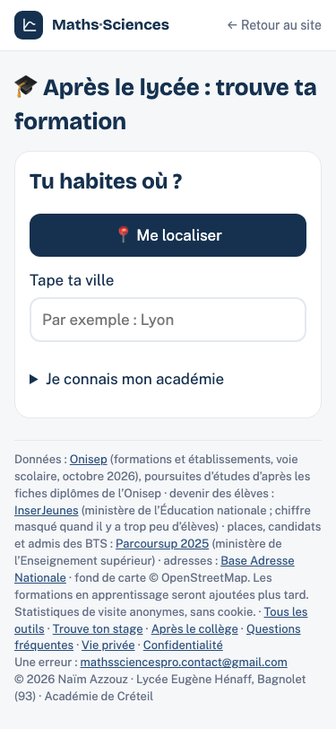
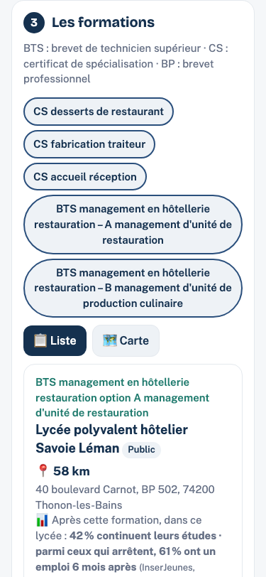
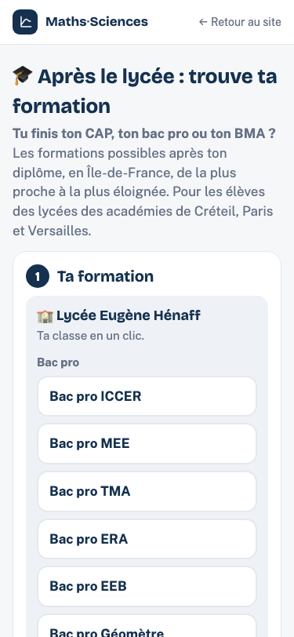
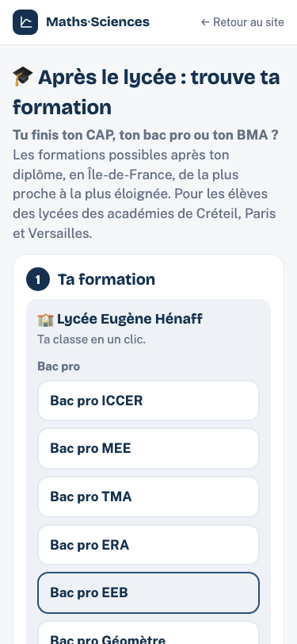

# Après le lycée — extension aux 30 académies

Préparé le 7 octobre 2026 sur `apres-lycee-france`, à partir de `origin/main` (`bcae229`). PR à relire, sans fusion ni publication.

Les nouvelles adresses `/formation/france/` et `/formation/<académie>/` réutilisent **sans modification** `commun/academie.js`, le catalogue des académies, les départements et les contours. Deux fichiers locaux sont chargés par académie : les formations, puis leurs chiffres Parcoursup (en parallèle). Aucun téléchargement national au chargement, aucun nouveau service tiers. La Base Adresse Nationale n'est appelée qu'après saisie ; le GPS du sélecteur utilise les contours locaux.

La page `/formation/` garde l’Île-de-France et Hénaff en premier, sans question. Ses deux JSON restent inchangés. Les quatre adaptations du HTML historique sont des gardes de chargement pour l’adaptateur national et la conservation du chemin dans les liens avec un fragment. Les 11 fragments de classes et `#d=…&ly=…` sont vérifiés. La FAQ, le README, les autres outils et `commun/` ne sont pas modifiés.

## Sources et dates

- [Onisep, Idéo — univers lycée](https://opendata.onisep.fr/data/605340ddc19a9/2-ideo-actions-de-formation-initiale-univers-lycee.htm) et [univers enseignement supérieur](https://opendata.onisep.fr/data/605344579a7d7/2-ideo-actions-de-formation-initiale-univers-enseignement-superieur.htm), ODbL : fichiers historiques `605340ddc19a9.csv` et `sup2.csv` du **6 octobre 2026**, réutilisés intégralement. Départs filtrés sur `ENS académie` et CAP/CAP agricole/bac pro/BMA ; lieux de poursuite filtrés sur `ENS région`, selon le catalogue commun. Voie scolaire ; apprentissage hors périmètre de ces exports Onisep.
- Fiches diplômes Onisep : rubrique **Exemple(s) de formation(s)**. **272 fiches utilisées : 201 déjà en cache et 71 téléchargées le 7 octobre**, avec `curl`, un User-Agent de navigateur et une pause de 3 secondes entre fiches. Aucune fiche manquante. Les fichiers nationaux utilisent directement la rubrique ; le mode historique garde sa logique et son ordre exacts. Le manifeste complet (identifiant, origine, date et SHA-256) figure dans `formation/data/bilan.json`.
- [InserJeunes, lycée professionnel, formation fine](https://data.education.gouv.fr/explore/dataset/fr-en-inserjeunes-lycee_pro-formation-fine/) : export national du **7 octobre 2026**, **22 458 lignes**, cumul **2023-2024**, Licence Ouverte. Même UAI, diplôme et option ; si plusieurs résultats distincts concordent, aucun chiffre. Les valeurs manquantes restent manquantes.
- [Parcoursup, vœux et réponses](https://data.enseignementsup-recherche.gouv.fr/explore/dataset/fr-esr-parcoursup/) : export national du **7 octobre 2026**, session **2025** (dernière session du jeu courant), **5 351 lignes BTS**, Licence Ouverte. Les fiches liées peuvent déjà afficher la campagne **2026** : les chiffres de la page restent explicitement datés **2025**.
- Dates et empreintes des fichiers bruts : `formation/data/bilan.json` ; URL et SHA-256 de l’export Parcoursup : `formation/data/bilan-parcoursup.json`. Les caches bruts restent hors dépôt.

### Fiches téléchargées pendant cette mission

Identifiants Onisep `FOR` (71) : 1008, 1037, 1083, 10903, 10971, 1136, 1155, 12769, 12772, 1356, 1393, 1398, 1399, 1467, 1496, 1499, 1983, 2135, 2215, 2501, 2520, 2661, 289, 2906, 2907, 2912, 3035, 3218, 3532, 369, 3834, 4245, 4315, 4573, 480, 502, 503, 5355, 5371, 5387, 5388, 5653, 5818, 586, 6057, 6058, 6086, 6088, 6105, 6112, 6123, 6124, 639, 669, 671, 6852, 687, 7155, 7409, 7692, 7694, 7708, 8260, 8606, 8785, 879, 8856, 912, 9255, 9256, 9681.

## Chiffres et tailles par académie

272 diplômes distincts au niveau national. La somme des fichiers représente **3 701 diplômes/académies, 3 191 lycées de départ, 4 966 poursuites/académies et 33 988 couples poursuite/lieu**. Un lieu est compté pour chaque formation qu’il propose ; les régions partagées par plusieurs académies sont répétées. Les totaux ne sont donc pas des nombres nationaux d’établissements uniques.

Tailles en **octets** ; gzip mesuré localement, sans garantie sur la compression du serveur. Fichier principal le plus lourd : Lyon, environ **1 Mo**, **145 ko gzip**. Les bilans et les décisions de revue ne sont jamais téléchargés par l’interface.

| Académie (`slug`) | Diplômes | Lycées | Poursuites | Couples poursuite/lieu | JSON | Gzip | Parcoursup JSON | Parcoursup gzip |
|---|---:|---:|---:|---:|---:|---:|---:|---:|
| aix-marseille | 143 | 140 | 188 | 1189 | 617102 | 80680 | 16921 | 4063 |
| amiens | 126 | 107 | 181 | 1549 | 777108 | 109336 | 26609 | 6153 |
| besancon | 109 | 73 | 148 | 684 | 383961 | 49041 | 10015 | 2496 |
| bordeaux | 150 | 177 | 212 | 1534 | 777243 | 105592 | 20771 | 5015 |
| clermont-ferrand | 130 | 84 | 204 | 1908 | 950283 | 136643 | 27932 | 6667 |
| corse | 47 | 12 | 42 | 63 | 60161 | 7968 | 1195 | 381 |
| creteil | 137 | 150 | 203 | 2021 | 948262 | 136631 | 36791 | 8570 |
| dijon | 126 | 97 | 161 | 683 | 398571 | 52255 | 10573 | 2639 |
| grenoble | 135 | 189 | 204 | 1942 | 983544 | 142830 | 27933 | 6663 |
| guadeloupe | 83 | 26 | 83 | 156 | 124204 | 14879 | 1483 | 475 |
| guyane | 91 | 24 | 71 | 113 | 104655 | 13273 | 977 | 341 |
| la-reunion | 120 | 44 | 136 | 303 | 227018 | 25104 | 5128 | 1348 |
| lille | 140 | 194 | 194 | 1558 | 800688 | 112185 | 27257 | 6299 |
| limoges | 102 | 43 | 171 | 1349 | 653352 | 87393 | 19416 | 4677 |
| lyon | 151 | 160 | 211 | 1985 | 1005381 | 145209 | 28093 | 6706 |
| martinique | 86 | 26 | 84 | 138 | 118485 | 14208 | 1618 | 500 |
| mayotte | 71 | 21 | 53 | 72 | 73911 | 9577 | 1093 | 391 |
| montpellier | 154 | 129 | 207 | 1538 | 776082 | 105623 | 21367 | 5217 |
| nancy-metz | 123 | 116 | 186 | 1249 | 644591 | 87126 | 20035 | 4784 |
| nantes | 155 | 223 | 179 | 1022 | 576229 | 77395 | 15431 | 3650 |
| nice | 114 | 60 | 172 | 1134 | 565664 | 72776 | 16707 | 4002 |
| normandie | 156 | 174 | 180 | 879 | 506684 | 66434 | 13476 | 3209 |
| orleans-tours | 136 | 120 | 155 | 604 | 361482 | 46921 | 10785 | 2658 |
| paris | 137 | 77 | 198 | 1953 | 902372 | 129680 | 36682 | 8524 |
| poitiers | 143 | 107 | 205 | 1467 | 734053 | 101170 | 20174 | 4875 |
| reims | 106 | 68 | 181 | 1245 | 628695 | 83452 | 20712 | 4934 |
| rennes | 147 | 173 | 186 | 906 | 505570 | 66455 | 12476 | 3064 |
| strasbourg | 103 | 60 | 168 | 1157 | 587540 | 77627 | 19937 | 4755 |
| toulouse | 150 | 155 | 204 | 1561 | 785460 | 106296 | 21606 | 5267 |
| versailles | 130 | 162 | 199 | 2026 | 949358 | 138091 | 35622 | 8294 |

## Parcoursup : méthode et taux par région

Même spécialité et option, avec la règle historique pour la première année commune explicitement indiquée ; site à moins de 100 m, ou nom proche à moins de 2 km. Plusieurs fiches candidates distinctes : aucun chiffre. Les noms différents passent en plus par une décision enregistrée, liée au nom, à l’UAI Parcoursup, à la spécialité, au numéro de fiche et à la distance ; une modification de ces éléments invalide la confirmation.

**1 197 paires de noms examinées individuellement** avec ville, distance et identifiants des deux exports : 1 154 paires confirmées par un UAI identique et des noms compatibles ; 43 paires non confirmées (37 UAI différents, 6 absents côté Onisep). Cela représente **2 881 lignes de formations confirmées**, **79 écartées**. Exemples écartés : ISCPA/SUPDECOM à Lyon (écoles voisines), Ynov/ICOF à Lyon, Pigier/ORT à Strasbourg, IPSSI/EPSI à Lille. Un établissement regroupant plusieurs sections mais des UAI différents reste aussi sans chiffre faute de confirmation suffisante.

Décisions détaillées : `source/formation_parcoursup_revues.json`. La revue porte sur les deux sources, sans prétendre à une visite de chaque établissement. Les cinq contrôles ci-dessous ajoutent une consultation des fiches officielles.

**4 500 rapprochements sur 6 483 couples BTS/site uniques par région (69,4 %)** ; 1 870 sans candidat conforme, 34 ambigus et 79 noms non confirmés. Les 30 fichiers portent 9 634 lignes au total, à cause des régions partagées. Le dénominateur comprend tous les BTS/BTSA avec lieux du périmètre, y compris les écoles absentes de Parcoursup.

| Région | Couples BTS/site | Reliés | Taux | Sans candidat | Ambigus | Noms non confirmés |
|---|---:|---:|---:|---:|---:|---:|
| Auvergne-Rhône-Alpes | 719 | 515 | 71,6 % | 187 | 4 | 13 |
| Bourgogne-Franche-Comté | 252 | 195 | 77,4 % | 52 | 5 | 0 |
| Bretagne | 362 | 228 | 63,0 % | 122 | 9 | 3 |
| Centre-Val de Loire | 245 | 198 | 80,8 % | 47 | 0 | 0 |
| Corse | 28 | 21 | 75,0 % | 5 | 1 | 1 |
| Grand Est | 510 | 381 | 74,7 % | 126 | 0 | 3 |
| Guadeloupe | 65 | 27 | 41,5 % | 38 | 0 | 0 |
| Guyane | 30 | 17 | 56,7 % | 13 | 0 | 0 |
| Hauts-de-France | 606 | 501 | 82,7 % | 96 | 1 | 8 |
| La Réunion | 117 | 93 | 79,5 % | 24 | 0 | 0 |
| Martinique | 61 | 29 | 47,5 % | 31 | 0 | 1 |
| Mayotte | 23 | 19 | 82,6 % | 4 | 0 | 0 |
| Normandie | 360 | 248 | 68,9 % | 110 | 1 | 1 |
| Nouvelle-Aquitaine | 583 | 378 | 64,8 % | 193 | 2 | 10 |
| Occitanie | 695 | 396 | 57,0 % | 288 | 3 | 8 |
| Pays de la Loire | 419 | 282 | 67,3 % | 127 | 0 | 10 |
| Provence-Alpes-Côte d'Azur | 523 | 309 | 59,1 % | 194 | 7 | 13 |
| Île-de-France | 885 | 663 | 74,9 % | 213 | 1 | 8 |

## Cinq poursuites tirées au sort et contrôlées

Tirage reproductible `random.Random(20261007)` : dans chacune des cinq académies, un diplôme ayant des poursuites locales, puis une poursuite, puis un lieu. Consultation le **7 octobre 2026** : les dix fiches Onisep et les deux fiches Parcoursup répondent en HTTP 200. Les fiches des diplômes citent les cinq poursuites et les fiches des lieux les proposent. Les adresses concordent. Détail structuré : `formation/verification/echantillon.json`.

1. **lyon** — [Bac pro ouvrages du bâtiment : métallerie](https://www.onisep.fr/http/redirection/formation/slug/FOR.1478) → **BTS conception des produits industriels**, [Lycée polyvalent Joseph-Marie Carriat](https://www.onisep.fr/http/redirection/etablissement/slug/ENS.798), 1 rue de Crouy, 01000 Bourg-en-Bresse.
   Ligne Parcoursup 2025 contrôlée dans l’export : **13 places, 231 candidats, 11 admis dont 1 issus de bac pro**. [Fiche nº 18838](https://dossierappel.parcoursup.fr/Candidats/public/fiches/afficherFicheFormation?g_ta_cod=18838) : même BTS et même établissement ; la fiche actuelle porte la campagne 2026.
2. **lille** — [Bac pro technicien menuisier agenceur](https://www.onisep.fr/http/redirection/formation/slug/FOR.3119) → **BTS systèmes constructifs bois et habitat**, [Lycée Jean Prouvé - Lomme](https://www.onisep.fr/http/redirection/etablissement/slug/ENS.5738), 2 rue de Lompret, BP 30327, 59463 Lille.
   Ligne Parcoursup 2025 contrôlée dans l’export : **18 places, 154 candidats, 13 admis dont 4 issus de bac pro**. [Fiche nº 7153](https://dossierappel.parcoursup.fr/Candidats/public/fiches/afficherFicheFormation?g_ta_cod=7153) : même BTS et même établissement ; la fiche actuelle porte la campagne 2026.
3. **aix-marseille** — [CAP accompagnant éducatif petite enfance](https://www.onisep.fr/http/redirection/formation/slug/FOR.6821) → **Bac pro accompagnement, soins et services à la personne**, [Lycée professionnel Les Fauvettes](https://www.onisep.fr/http/redirection/etablissement/slug/ENS.15721), 44 avenue Jean de Noailles, 06400 Cannes.
   Aucun chiffre Parcoursup affiché : formation hors du périmètre BTS/BTSA du rapprochement.
4. **rennes** — [Bac pro conduite et gestion des entreprises maritimes - commerce/plaisance professionnelle option voile](https://www.onisep.fr/http/redirection/formation/slug/FOR.6058) → **BTS maritime pêche et gestion de l'environnement marin**, [Lycée professionnel maritime du Guilvinec](https://www.onisep.fr/http/redirection/etablissement/slug/ENS.4698), Avenue Jos Quiniou, BP 32, 29730 Treffiagat.
   Aucun chiffre Parcoursup affiché : pas de rapprochement conforme pour ce BTS maritime.
5. **la-reunion** — [BMA arts graphiques option A signalétique](https://www.onisep.fr/http/redirection/formation/slug/FOR.5664) → **DN MADE mention graphisme**, [Lycée général et technologique Ambroise Vollard](https://www.onisep.fr/http/redirection/etablissement/slug/ENS.15544), 3 avenue de Soweto, Terre Sainte, BP 399, 97448 Saint-Pierre.
   Aucun chiffre Parcoursup affiché : formation hors du périmètre BTS/BTSA du rapprochement.

Le lieu de Cannes est dans l’académie de Nice, mais bien dans la même région que l’élève d’Aix-Marseille : c’est le périmètre régional demandé.

## Vérifications

- `formation/tests/donnees.py` : provenance des diplômes, des poursuites et des lieux, région, exactitude des nombres Parcoursup et exclusion des cas ambigus, absence d’adresses électroniques, JSON historiques et `commun/` inchangés. **Réussi : 9 634 lignes Parcoursup conformes.**
- `formation/tests/national.cjs` : navigateur Chromium réel, **375 × 812 px**, **console sans erreur**, pas de débordement horizontal. Lyon, Lille, Aix-Marseille, Rennes et La Réunion : adresse directe, mémoire priorisée par l’URL, GPS simulé, ville avec BAN réelle, changer et choix manuel. Après chaque choix : diplôme, lycée et poursuites. Rechargement du lien, carte, réseau, entrée France, stockage bloqué et refus du GPS. Les 30 adresses ont aussi été parcourues avec un choix diplôme/lycée.
- `/formation/` et les 11 classes Hénaff contrôlées ; inspection visuelle sur téléphone de la page, de `#eeb`, `#iccer`, `#mee`, `#tma` et `#bma-ebeniste`. La comparaison avec les pages publiques couvre texte et contrôles, avec captures locales/publiques produites pour chaque adresse.
- Résultats : `formation/verification/navigateur.txt`, `donnees.txt` et `verif-idf.txt`.

### Résultat intégral de `source/verif_idf.py`

```text
Référence origin/main : a502c75f06011e5b1127d1a61208013e679dec48
aide/aide.json : identique à origin/main ; SHA-256 0e7273d055ab81dc8d2ab14fa4dca3fae6ef12283928ae2479aff6ee566625a7
apres-3e/apres3e.json : identique à origin/main ; SHA-256 eb16cf4f0e77fa2fe076b71ee20fbec77636dcb075a289e894fc6b28c6374d8b
formation/formations.json : identique à origin/main ; SHA-256 f7a477eff3766dfc24df573358658e067112c6b3f79f05bb9851cd3cee234270
formation/parcoursup.json : identique à origin/main ; SHA-256 0ad318607fb6555474ae039dcb9414e05286b53e07a3a091e3ed8fa4313b61f0
Régénération aide (mode par défaut) : identique à l’octet près
Régénération Après le collège (mode par défaut) : identique à l’octet près
Régénération Après le lycée (mode par défaut) : identique à l’octet près
Régénération Parcoursup (mode par défaut) : identique à l’octet près
/aide/ : identique, sans erreur
/aide/#mda : identique, sans erreur
/apres-3e/ : identique, sans erreur
/apres-3e/#cuisine : identique, sans erreur
/formation/ : identique, sans erreur
/formation/#eeb : identique, sans erreur
/formation/#iccer : identique, sans erreur
/ : identique, sans erreur
/henaff/ : identique, sans erreur
/iccer : identique, sans erreur
/formation/#mee : identique, sans erreur
/formation/#tma : identique, sans erreur
/formation/#era : identique, sans erreur
/formation/#geometre : identique, sans erreur
/formation/#mit : identique, sans erreur
/formation/#sdg : identique, sans erreur
/formation/#ebeniste : identique, sans erreur
/formation/#bma-ebeniste : identique, sans erreur
/formation/#bma-signaletique : identique, sans erreur
/formation/#d=5601&ly=0932119Y : identique, sans erreur
Île-de-France identique : oui
Rapport et captures : /private/tmp/verif-idf-formation
```

### Captures téléphone

| Question | Poursuites à Lyon |
|---|---|
|  |  |

| Île-de-France inchangée | Classe EEB inchangée |
|---|---|
|  |  |

[Résultats EEB](idf-eeb-poursuites.png) · [ICCER](idf-iccer-poursuites.png) · [MEE](idf-mee-poursuites.png) · [TMA](idf-tma-poursuites.png) · [BMA ébéniste](idf-bma-ebeniste-poursuites.png).

## Incertitudes et limites

- Le catalogue commun reste la référence des **30 académies**. Aucun rattachement supplémentaire inventé pour les collectivités ultramarines hors catalogue. Monaco est exclu, comme dans Après le collège. Les coordonnées invalides sont écartées ; le journal liste les cas (6 établissements distincts au total).
- **98 rapprochements InserJeunes incertains** : aucun chiffre. **303 identifiants Onisep sans UAI** dans les sources préparées : identifiant local explicite `onisep:<id>` lorsqu’un tel lieu est utilisé, sans lui inventer un UAI. Ces nombres concernent les sources préparées, pas nécessairement tous les lieux affichés.
- **12 présences de diplômes/académies sans exemple de poursuite** dans la rubrique Onisep : message explicite et lien vers la fiche, sans suggestion inventée. Une poursuite citée mais sans lieu régional est signalée comme telle.
- Aucun apprentissage ajouté. Un lieu absent des fichiers ne signifie pas que la formation n’existe pas. La déduplication des lieux par UAI suit le générateur historique ; certains établissements peuvent avoir plusieurs sites.
- Les 79 rapprochements de noms non confirmés et les 34 cas ambigus Parcoursup restent sans chiffres. Le rapprochement historique IDF est conservé à l’octet près ; les nouvelles pages d’académie appliquent la prudence supplémentaire, d’où **663** couples IDF reliés contre **672** dans le fichier historique.
- Les champs de contact ne sont pas exportés. Les champs de site web, page web, hébergement ou frais contenant une adresse électronique sont omis (16 établissements dans la préparation des sources). Cela évite aussi les adresses enfouies dans les commentaires d’hébergement.
- L’admission dépend du dossier ; le rappel et le renvoi au professeur principal ou au psychologue de l’Éducation nationale restent affichés. Les chiffres Parcoursup ne sont pas une probabilité individuelle d’admission.
- Cache : les téléchargements existants sont réutilisés ; pour une nouvelle collecte, utiliser un cache neuf. Une mise à jour des sources demande de régénérer, revoir les noms modifiés, incrémenter la version de chargement et relancer les contrôles. Les dates de collecte ne valent pas date de mise à jour de chaque fiche.

## Reproduire

```sh
python3 source/apres_lycee.py --academies toutes --sources "$SOURCES_ONISEP" --cache "$CACHE_FORMATION"
python3 source/parcoursup.py --academies toutes --cache "$CACHE_FORMATION"
python3 formation/tests/donnees.py --sources "$SOURCES_ONISEP" --cache "$CACHE_FORMATION"
python3 -m http.server 8767 --bind 127.0.0.1
# Dans un autre terminal, Playwright doit être installé ou indiqué par PLAYWRIGHT_MODULE.
BASE_URL=http://127.0.0.1:8767 node formation/tests/national.cjs
python3 source/verif_idf.py --sources-idf "$SOURCES_AIDE" --sources-apres3e "$SOURCES_APRES3E" --sources-formation "$SOURCES_ONISEP"
```

Sans argument, les deux scripts de génération gardent leur mode historique. Les sources nécessaires et leur cache sont explicités dans `--help` ; `verif_idf.py` annonce une vérification incomplète si les sources manquent, au lieu d’annoncer une fausse identité.
